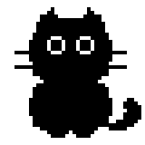
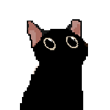

# Mira

Mira is a personal AI assistant with two halves:

- **The brain** — a small Python/Flask agent that streams chat completions from an OpenAI-compatible LLM, deployed as a container on **GreenNode AgentBase**.
- **The body** — [`pixel-cat/`](pixel-cat/), an Electron desktop pet (a Comnyang-style pixel cat) that talks to the agent and adds reminders, a Pomodoro timer, and a checklist — many of them drivable in plain language.

The two communicate only over HTTP (`POST /chat`, server-sent events), so they deploy and version independently: the agent ships as a Docker image, the desktop pet ships as a downloadable app.

<p align="center">
  
  
  
</p>

<p align="center"><strong>Idle companion</strong> · <strong>Yapping replies</strong> · <strong>Keyboard chaos</strong></p>

```
┌──────────────────────┐         POST /chat (SSE)        ┌──────────────────────┐
│  pixel-cat (Electron)│  ───────────────────────────▶   │  Flask agent (app.py)│
│  desktop pet / client│  ◀───────────────────────────   │  on GreenNode        │
└──────────────────────┘        streamed reply           └──────────┬───────────┘
                                                                     │ OpenAI-compatible
                                                                     ▼
                                                          VNG MaaS LLM (Gemma)
```

## Repo layout

| Path | What it is |
|------|------------|
| `app.py` | Flask agent: `POST /chat` (SSE stream), `GET /health`, and a web chat UI at `/` |
| `chatbot.py` | The same chat loop as a terminal REPL (handy for quick local testing) |
| `templates/index.html` | Web chat UI served by `app.py` |
| `Dockerfile`, `requirements.txt` | Container build for AgentBase deployment |
| `pixel-cat/` | The Electron desktop pet client — see [`pixel-cat/README.md`](pixel-cat/README.md) |

## The agent

OpenAI-compatible client pointed at the VNG MaaS LLM endpoint; the system prompt makes the model answer as "Mira". `app.py` exposes:

- `POST /chat` — body `{ "history": [{role, content}, ...] }`, responds with an SSE stream of `data: {"content": "..."}` chunks ending in `data: [DONE]`.
- `GET /health` — `{"status": "ok"}`.
- `GET /` — a simple web chat page.

### Run locally

```bash
pip install -r requirements.txt
# create a .env (see below), then:
python app.py        # serves on http://localhost:8080
# or, for a terminal chat:
python chatbot.py
```

Point the desktop pet at your local agent by setting `agentUrl` in `%APPDATA%/Mira/config.json` to `http://localhost:8080`. The bundled `pixel-cat/config.json` is the default used for packaged releases; the per-user config overrides it after first launch.

### Deploy (GreenNode AgentBase)

The agent runs as a container (`Dockerfile` → port 8080, `/health` check). Build and push the image, then create/update an AgentBase runtime; its `DEFAULT` endpoint URL goes in `pixel-cat/config.json` so the shipped desktop app reaches it by default. See the AgentBase skills under `greennode-agentbase-skills/` (cloned separately, gitignored) for the deploy/runtime commands.

## The desktop pet

A transparent always-on-top pixel cat that chats with the agent (with text or images) and layers on productivity tools — reminders (one-off/daily/weekly), a Pomodoro HUD, and a tasks+subtasks checklist with progress bars — several creatable by just talking to her. Full details, controls, and architecture: [`pixel-cat/README.md`](pixel-cat/README.md).

```bash
cd pixel-cat
npm install --ignore-scripts
npm start
```

`--ignore-scripts` matters for local development from this repo path: the folder lives under a path containing `&`, which breaks npm lifecycle scripts on Windows. The native dependency (`uiohook-napi`) ships prebuilt binaries, and the `start` script invokes Electron through Node for the same reason.

### Desktop features

- **Idle presence** - eyes/head follow the cursor, with blink, ear flick, tail sway, whisker twitch, drag-to-move, scroll-to-resize, double-click-to-quit, and click-through outside the cat/chat UI.
- **Chat** - click Mira to chat with the deployed agent; replies stream into a speech bubble while she yaps.
- **Image input** - attach or paste an image; the renderer downsizes it before sending it to the agent.
- **Typing reaction** - global keystrokes drive the keyboard/paw animation; sustained fast typing adds an overheat tint.
- **Cat color customization** - right-click `Cat color...` to tune Mira with RGB sliders from 0-255; the color persists in local settings.
- **Reminders** - one-off, daily, or weekly reminders can be managed in the Reminders window or created through chat. Completed one-offs are retained for the workweek; recurring reminders roll forward across restarts.
- **Checklist** - tasks with subtasks, progress bars, deadlines, top-level done/undo for tasks without subtasks, and hide-from-view behavior that still preserves the weekly record.
- **Mood check-ins** - weekdays at 09:30, Mira asks how the user is feeling and adapts the next prompt to the previous workday. Fridays at 17:00, she opens a visual recap with emoji mood trail, conquered checklist/reminder activity, and encouragement based on the week.
- **Pomodoro** - configurable focus/break/long-break timer with a transparent HUD anchored above Mira.
- **Natural-language create** - chat requests like "remind me..." or "create a task..." can create local reminders/tasks through hidden action blocks parsed by the renderer.
- **Personalized onboarding** - first launch collects name, department, hobbies, and preferred tone; returning users skip it.

### Desktop architecture

- `pixel-cat/main.js` owns the Electron windows, global cursor/key hooks, local schedules, user state, right-click menu, dialog windows, Pomodoro timer, cat color settings, reminder engine, checklist engine, mood check-ins, and the Friday recap.
- `pixel-cat/preload.js` exposes the safe `catAPI` bridge used by the transparent renderer.
- `pixel-cat/dialog-preload.js` exposes the shared `api` bridge used by profile/reminders/Pomodoro/checklist/cat color/weekly recap dialogs.
- `pixel-cat/index.html` renders the cat, bubble, input, onboarding/tour, image attach flow, chat streaming, hidden action-block parsing, and mood prompt capture.
- `pixel-cat/dialogs/*.html` are small focused UI windows for profile, reminders, Pomodoro, checklist, cat color, and the Friday weekly recap.
- `pixel-cat/clock.html` plus `clock-preload.js` are the Pomodoro HUD.
- State lives in `%APPDATA%/Mira/`: `config.json` (agent endpoint override), `profile.json`, `mood.json` (check-ins + latest weekly recap), `reminders.json`, `tasks.json`, and `settings.json` (timer color + cat color).
- The file renderer cannot call the deployed agent directly because of CORS, so `main.js` relays `POST /chat` and streams SSE chunks back over IPC.

### Desktop assets and tuning

- `assets/mira_still.png` is the source sheet for the rig; `tools/generate_rig.py` rebuilds `mira_base.png`, `mira_rig.png`, and `rig-meta.json`.
- `assets/mira_yapping.png` and `assets/mira_typing_80x80.png` are hand-made animation sheets.
- `docs/media/mira-*.gif` are README animations generated from the same app sprites.
- Common tuning constants live in `index.html` and `main.js`: cat scale, bubble dimensions, yap speed, reply typewriter speed, typing decay, and overheat gain/cooldown.

## GitHub release

Tagged releases build Windows artifacts in GitHub Actions:

- `Mira-<version>-win.zip` - the full-feature Windows app packaged as a ZIP.

The hackathon build is currently unsigned. On some Windows machines, Defender or SmartScreen may flag a new unsigned Electron build before it has reputation, especially because Mira includes a global keyboard hook for the typing animation. If Defender flags a release, check Windows Security > Virus & threat protection > Protection history for the detection name, then submit the exact release file to [Microsoft Security Intelligence](https://www.microsoft.com/en-us/wdsi/filesubmission) as a software developer and mark it as incorrectly detected. The permanent production fix is to sign releases with an Authenticode code-signing certificate.

## Configuration

Secrets live in a `.env` at the repo root (never committed — see `.gitignore`):

| Variable | Purpose |
|----------|---------|
| `HACKATHON_API_KEY` | API key for the VNG MaaS LLM endpoint used by `app.py` / `chatbot.py` |
| `GREENNODE_CLIENT_ID` / `GREENNODE_CLIENT_SECRET` | IAM credentials for AgentBase deployment |

The desktop pet keeps its own per-user state (profile, mood check-ins, reminders, tasks, settings) in `%APPDATA%/Mira/`, not in this repo.
On first launch it also creates `%APPDATA%/Mira/config.json`; edit that file to point the packaged app at a different agent endpoint without rebuilding.

## Status

Built for the VNG GreenNode Claw-a-thon 2026. The agent is deployed and the desktop pet connects to it; packaging is focused on a Windows ZIP release for GitHub, built locally or by the `Build Mira Windows ZIP` workflow.

## Credits

- App icon: [Cat Footprint](https://icons8.com/icon/9603/cat-footprint) icon by [Icons8](https://icons8.com).
